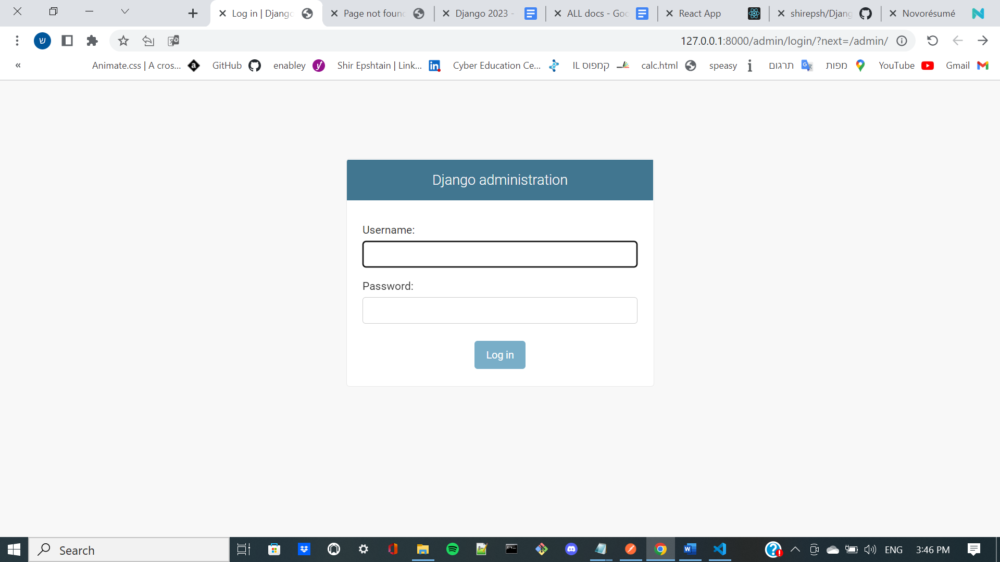
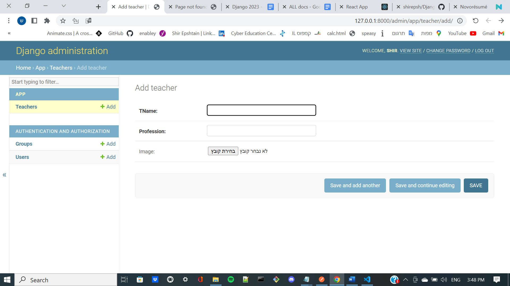

# DJANGO upload fiels & images template

- using the following technologies: python, django, sqlite3, sqlAlchimy

### **project locator:**
https://github.com/shirepsh/Django_upload_fiels_template
1. enter into GitHub & serach my profil as - shirepsh
2. in my repositorie looking for - "django_react_authentication_login_register_template"
3. open the terminal in your Workspace 

### **in this project you have Backend using DJANGO and fronted using REACT, You should open 2 terminal while working.**


# **guide line:**
- If you have not installed Python3, please do
- Please make sure you have 'pip' installed on your OS. 
If it is not installed, please refer to the link below and follow the steps: [Link to PyPa.io](https://pip.pypa.io/en/stable/cli/pip_install/)


1. download the project from GitHub by the comment:
```bash
git clone
```
2. install virtualenv
```bash 
pip install virtualenv
```
4. open venv named venv
```bash
python -m virtualenv venv
```
5. get into the venv 
```bash
venv\Scripts\active
```
6. install all the right packages with the requirements file
```bash
pip install -r requirements.txt  
``` 
7. run the application by the comment:
```
py manage.py runserver
```
8. create superuser at the terminal (give name, email, password)
```
py manage.py createsuperuser    
```
9. run the server again

10. copy the given url to the browser and add /admin == move to admin page



11. do login & add teacher with image as you want

